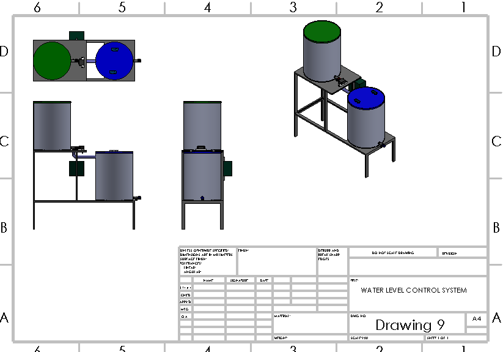
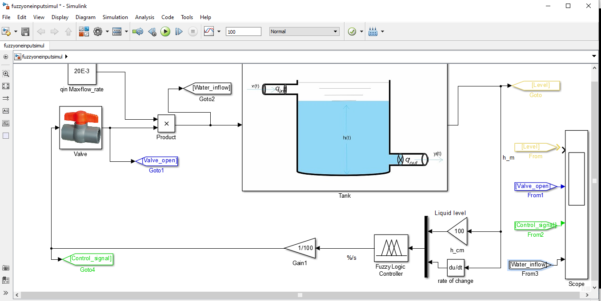
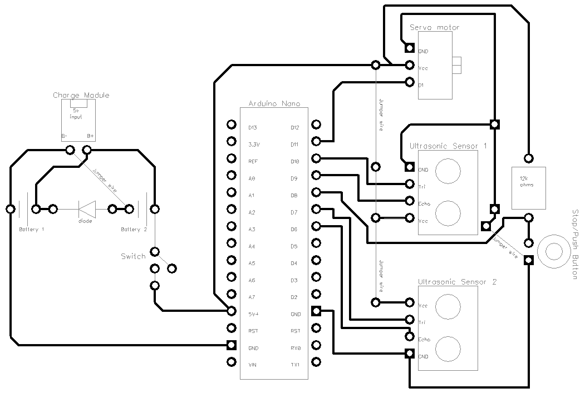

# WATER LEVEL CONTROL USING FUZZY LOGIC CONTROLLER

Author: Rufus  
Date: 10th of September, 2021.  
Supervisor: DR. ENGR. O.O. Martins  
Revision: 0.0.1v  
License: Public Domain 

        
        

## FUNCTION

This system is designed and implemented to reduce to minimum the menance that production company faces around water control systems. This system solved the problem by using a human being type of intelligency called fuzzy logic.  
The system receive input signal from the level sensor in a tank and respectively close or open gradually the pump/valve.

        
        

## INSTALLATION  
 ## Step 1: Installation
1. Open this file  
2. Edit as you like (the comments in the code will help you).

## Step 2: Assemble the circuit

Assemble your circuit rightly.

        
        

## Step 4: Load the code

Upload the code contained in this sketch on to your board.

## License
This project is released under a {License} License.

## Contributing
To contribute to this project please contact Rufus @  
otruke1@gmail.com

## Technology for this System
* MATLAB
* Arduino Nano